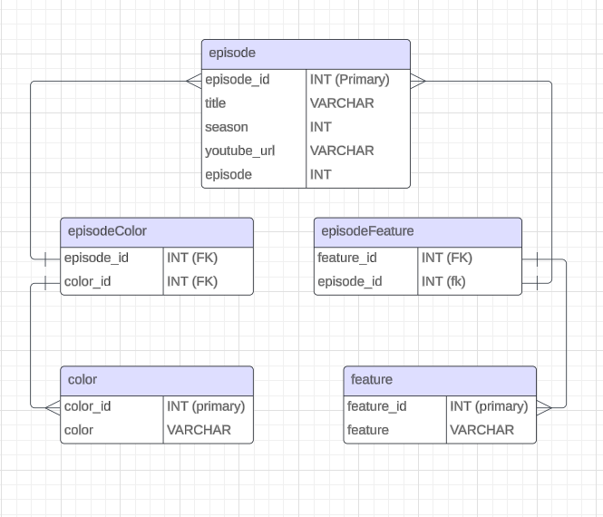

# The Joy of Painting API

Welcome to **The Joy of Painting API**, a project designed to manage and query episodes of the beloved Bob Ross show, *The Joy of Painting*. This API allows you to extract and filter data about episodes, including information such as the month of the original broadcast, subject matter, and color palette.

---



## Features

- **ETL Process**: Extracts data from various sources, transforms it into a usable format, and loads it into a MySQL database.
- **Filtering Capabilities**:
  - Filter by **Month of Broadcast**.
  - Filter by **Color Palette**.
  - Filter by **Features/Subjects** in the painting.
  - Combine filters using `AND` or `OR` logic.
- **Pagination**: Supports browsing through data with `page` and `limit` query parameters.

---

## Getting Started

Follow these steps to get the project up and running on your local machine.

---

### Prerequisites

1. **Node.js** (v16 or higher recommended)
2. **MySQL** (Ensure you have it installed and running)
3. **Postman** or a browser for testing APIs (optional)

---

### Installation

1. Clone the repository:
   ```bash
   git clone https://github.com/your-username/the-joy-of-painting-api.git
   ```

2. Navigate to the project directory:
   ```bash
   cd the-joy-of-painting-api
   ```

3. Install dependencies:
   ```bash
   npm install
   ```

### Setting Up the Database

1. **Create the Database**: Run the `create_db.js` script to set up your database schema and initial data:
   ```bash
   node ./db/create_db.js
   ```

2. **Run ETL Scripts**: Execute the ETL scripts to populate the database with data from different source files:
   ```bash
   node ./scripts/etl_colors_used.js
   ```
      ```bash
   node ./scripts/etl_episode_dates.js
   ```
   ```bash
   node ./scripts/etl_subject_matter.js
   ```


### Running the Server

1. **Start the server**:
   ```bash
   node app.js
   ```

2. **Verify the server is running**: Open a browser and visit: [http://localhost:3000](http://localhost:3000)

   You should see: **Welcome to The Joy of Painting API**

---

## Using the API

### Base URL

```bash
http://localhost:3000
```

### Endpoints

1. **GET /episodes**
   - Filter and retrieve episode data. Use query parameters to customize the results.

   #### Query Parameters:
   - **filters (JSON array)**:
     - Example: `[{"field":"month","value":"1","operator":"EQUALS"}]`
   - **filterType (AND or OR)**: Combine filters logically.
   - **page**: Page number for pagination.
   - **limit**: Number of results per page.

   #### Examples:
   - **Episodes in January**:
     ```bash
     http://localhost:3000/episodes?filters=[{"field":"month","value":"1","operator":"EQUALS"}]
     ```
   - **Episodes with specific colors**:
     ```bash
     http://localhost:3000/episodes?filters=[{"field":"colors","value":"Phthalo Blue,Alizarin Crimson","operator":"INCLUDES"}]
     ```
   - **Combining filters with AND**:
     ```bash
     http://localhost:3000/episodes?filters=[{"field":"month","value":"1","operator":"EQUALS"},{"field":"colors","value":"Phthalo Blue","operator":"INCLUDES"}]&filterType=AND
     ```

---

## Testing the API

- **Postman**: Import the API endpoint and use the query parameters for testing.
- **Browser**: Enter the query URL in the address bar.

---

## Technologies Used

- **Node.js**: Backend framework
- **MySQL**: Relational database
- **Express**: Web server framework
- **Body-parser**: Middleware for handling JSON